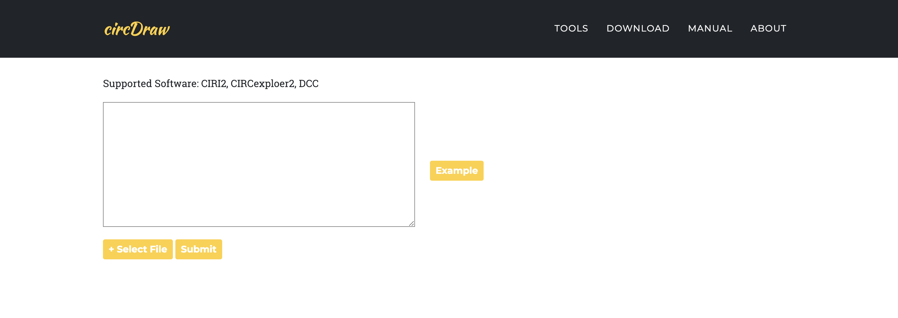

# CircDraw

An online circRNA visualization and analysis tool. 

Using [circDraw](http://144.202.101.9)

### Introduction

The circDraw allow visualization circRNA analysis results of circRNA analysis tools. It's user friendly and allow you to get your picture within few clicks. 

### Manual

#### File Upload

Supported circRNA software

- CIRI2

Upload instruction:
- Click the `GET START!` button from the main page or use navigation button `TOOLS` to go to upload page.

- Use `+ Select File` and `Submit` button to upload file from your upstream processing software for circle RNA prediction, for example CIRI2. *Please note that we only support one file at a time for now.*

- Wait for about 1-3 mins depending on your network speed and enjoy the show!

### Circle RNA density distribution analysis
By processing the uploaded file in backend, you will be able to __interactively__ view the circle RNA density distribution results and explore your interest further.

[//]: # (### How to read Results?)

### Used library
#### Backend
- Python 3: https://www.python.org/
- Django: https://www.djangoproject.com/
- MySQL: https://www.mysql.com/cn/
- mysqlclient-python: https://github.com/PyMySQL/mysqlclient-python
- PyMySQL: https://pypi.python.org/pypi/PyMySQL
- ijson: https://pypi.org/project/ijson/

#### Algorithm
- NumPy: http://www.numpy.org/
- scikit-learn: http://scikit-learn.org/stable/

#### Frontend
- jQuery: https://jquery.com/

#### Deployment 
- Nginx: https://nginx.org/en/
- uWSGI: https://uwsgi-docs.readthedocs.io/en/latest/

[//]: # (## About)

### More Information

- Citation: 

- Contact: 

Copyright: Qu Lab, School of Life School, Sun Yat-sen University
